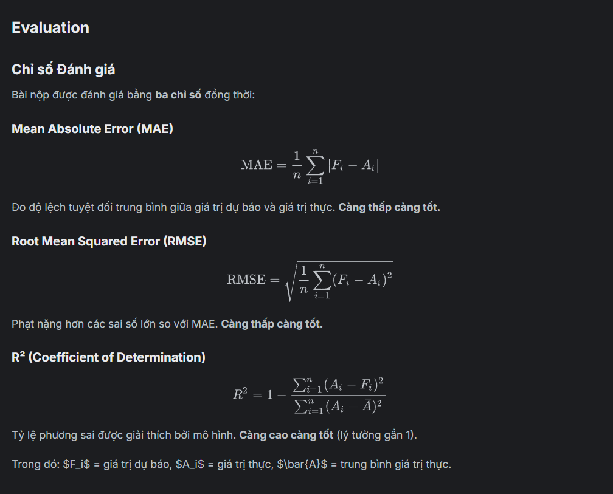

Overview
DATATHON 2026 — The Gridbreakers
Breaking Business Boundaries
Được tổ chức bởi VinTelligence — VinUniversity Data Science & AI Club

Chào mừng đến với Datathon 2026 — The Gridbreakers, cuộc thi Khoa học Dữ liệu đầu tiên tại VinUniversity!

Trong cuộc thi này, bạn sẽ đóng vai trò nhà khoa học dữ liệu tại một công ty thương mại điện tử thời trang Việt Nam. Nhiệm vụ của bạn là khai thác bộ dữ liệu thực tế mô phỏng toàn bộ hoạt động kinh doanh — từ đơn hàng, tồn kho, khuyến mãi đến lưu lượng website — để biến dữ liệu thành giải pháp kinh doanh.

Cuộc thi gồm 3 phần:

Phần	Nội dung	Điểm
1	Câu hỏi Trắc nghiệm (MCQ)	20 điểm
2	Trực quan hoá & Phân tích Dữ liệu (EDA)	60 điểm
3	Mô hình Dự báo Doanh thu (phần này — Kaggle)	20 điểm
Phần thi trên Kaggle tập trung vào Phần 3: Dự báo cột Revenue hàng ngày cho giai đoạn 01/01/2023 – 01/07/2024.

💡 Lưu ý quan trọng: Kết quả Kaggle chỉ là một phần trong tổng điểm. Bài nộp đầy đủ bao gồm báo cáo phân tích EDA và code pipeline — hãy xem hướng dẫn nộp bài đầy đủ trong phần Rules.

Start

a day ago
Close

14 days to go
Description
Bối cảnh kinh doanh
Bạn là nhà khoa học dữ liệu tại một công ty thương mại điện tử thời trang Việt Nam. Doanh nghiệp cần dự báo doanh thu chính xác ở mức chi tiết theo ngày để:

Tối ưu hoá phân bổ tồn kho
Lập kế hoạch khuyến mãi
Quản lý logistics trên toàn quốc
Bộ dữ liệu mô phỏng hoạt động của doanh nghiệp từ 04/07/2012 đến 31/12/2022 (tập train), bao gồm 15 file CSV được chia thành 4 lớp:

Master: sản phẩm, khách hàng, khuyến mãi, địa lý
Transaction: đơn hàng, chi tiết đơn, thanh toán, vận chuyển, trả hàng, đánh giá
Analytical: doanh thu theo ngày
Operational: tồn kho hàng tháng, lưu lượng website hàng ngày
Định nghĩa bài toán
Dự báo cột Revenue (doanh thu thuần hàng ngày) cho giai đoạn 01/01/2023 – 01/07/2024.

Mỗi dòng trong tập test là một bộ (Date, Revenue, COGS) duy nhất.

Split	File	Khoảng thời gian
Train	sales.csv	04/07/2012 – 31/12/2022
Test	sales_test.csv	01/01/2023 – 01/07/2024
Tập test không được công bố. Cấu trúc file test giống với sample_submission.csv.

Evaluation
Chỉ số Đánh giá
Bài nộp được đánh giá bằng ba chỉ số đồng thời:

Mean Absolute Error (MAE)

Đo độ lệch tuyệt đối trung bình giữa giá trị dự báo và giá trị thực. Càng thấp càng tốt.

Root Mean Squared Error (RMSE)

Phạt nặng hơn các sai số lớn so với MAE. Càng thấp càng tốt.

R² (Coefficient of Determination)

Tỷ lệ phương sai được giải thích bởi mô hình. Càng cao càng tốt (lý tưởng gần 1).

Trong đó: $F_i$ = giá trị dự báo, $A_i$ = giá trị thực, $\bar{A}$ = trung bình giá trị thực.

Điểm trên Kaggle (Phần 3 — 20 điểm tổng)
Thành phần	Mô tả	Điểm tối đa
Hiệu suất mô hình	Xếp hạng leaderboard dựa trên MAE, RMSE, R²	12 điểm
Báo cáo kỹ thuật	Pipeline, cross-validation, SHAP/feature importance	8 điểm
Mức điểm	Mô tả
10–12 điểm	Top leaderboard; MAE và RMSE thấp, R² cao
5–9 điểm	Hiệu suất trung bình, mô hình hoạt động nhưng chưa tối ưu
3–4 điểm	Bài nộp hợp lệ nhưng hiệu suất thấp
Định dạng File Nộp
Nộp file submission.csv với cấu trúc các dòng phải giữ đúng thứ tự như sample_submission.csv, không được sắp xếp lại hoặc xáo trộn.

Citation
Datathon 2026. DATATHON 2026 - Vòng Sơ loại. https://kaggle.com/competitions/datathon-2026-round-1, 2026. Kaggle.